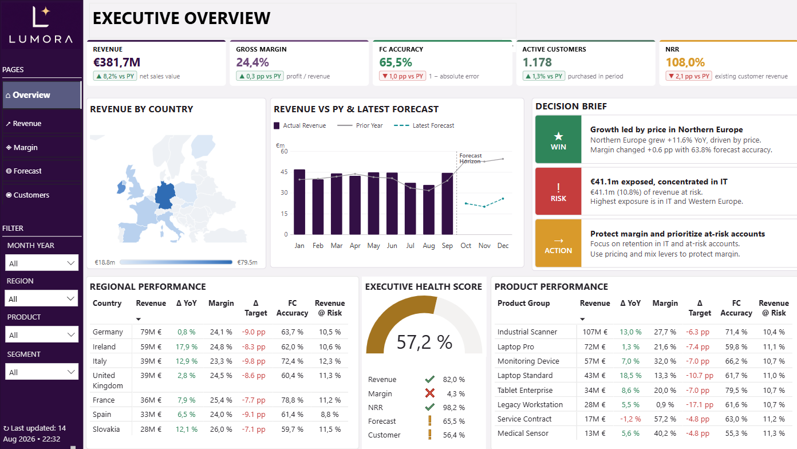
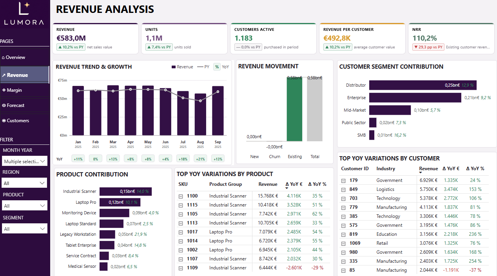
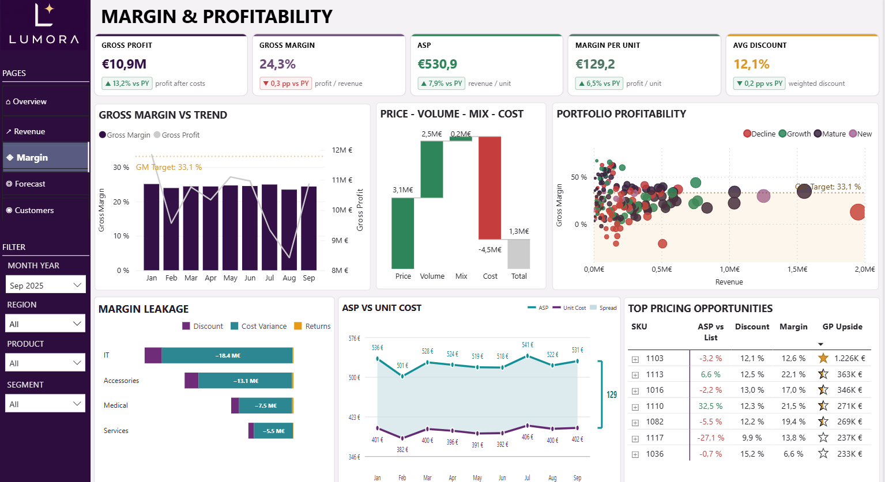
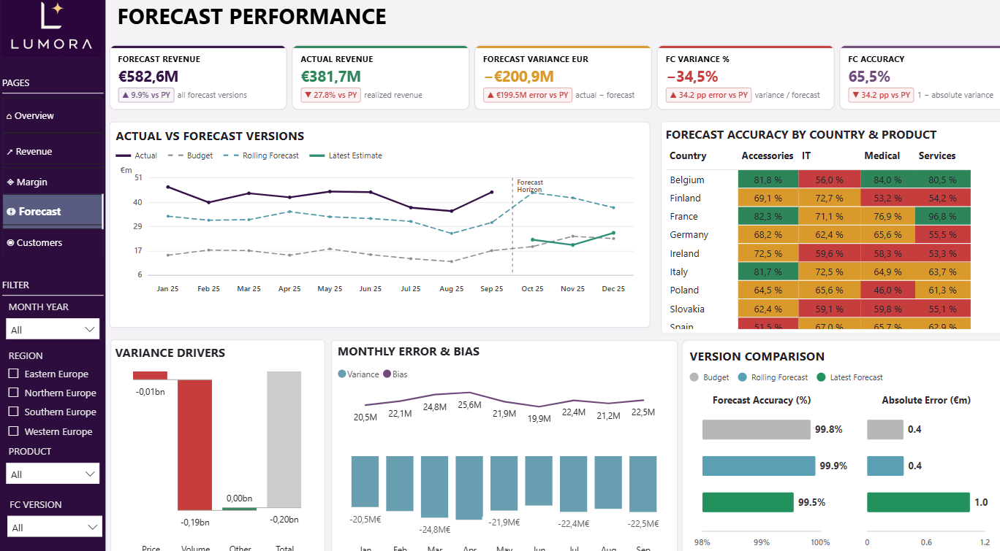
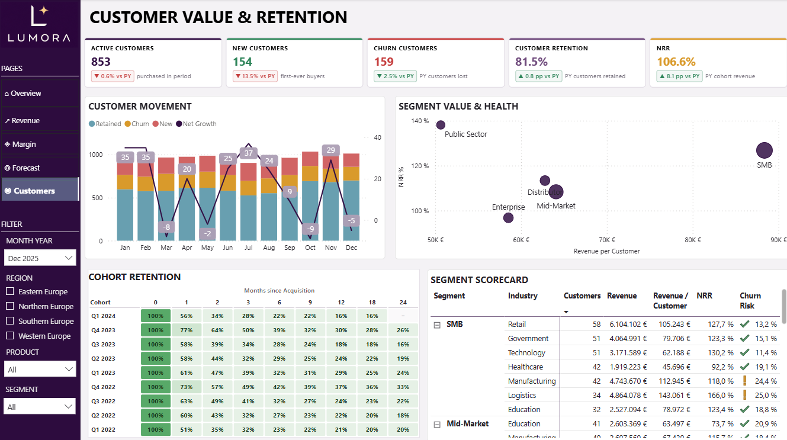

# Revenue Intelligence Platform




## Project Overview
The Revenue Intelligence Platform is an end-to-end Business Intelligence solution designed to simulate a realistic enterprise environment for a global B2B technology and medical products company.

The project combines data engineering, SQL-based data warehousing, financial analytics, and executive reporting to provide a comprehensive view of business performance across revenue, profitability, forecasting, products, and customers.

Built using Python, SQL Server, and Power BI, the solution demonstrates how modern organizations can transform transactional data into actionable business insights that support executive decision-making.

## Business Objectives
The platform is designed to answer key business questions such as:

- How is overall revenue performing?
- Which products, customers, and regions drive growth?
- What factors influence profitability and margin development?
- How accurate are revenue forecasts?
- Where is revenue at risk?
- Which customer segments are growing, expanding, or churning?
- What actions should management prioritize?

## Key Capabilities
### Executive Performance Management
- Executive KPI Reporting
- Revenue Intelligence
- Profitability Monitoring
- Forecast Performance Tracking
- Customer Health Monitoring

### Commercial Analytics
- Revenue Growth Analysis
- Price-Volume-Mix (PVM) Analysis
- Product Portfolio Performance
- Customer Segmentation
- Revenue Risk Detection

### Financial Analytics
- Gross Profit Analysis
- Margin Optimization
- Forecast Accuracy Analysis
- Pricing Performance Evaluation

### Data & Analytics Engineering
- Synthetic Enterprise Data Generation
- SQL Data Warehousing
- Star Schema Modeling
- Power BI Semantic Model Design
- DAX Calculations

## Business Context
The synthetic dataset simulates a global B2B company operating across:

- Multiple countries and regions
- Multiple customer segments
- Multiple product families
- Multiple currencies
- Multiple fiscal years

The generated data includes realistic business dynamics such as:

- Revenue growth and decline
- Forecast inaccuracies
- Customer churn
- Product mix shifts
- Margin variation
- Regional performance differences
- Inventory fluctuations
- CRM activity tracking
- Product returns

## Technology Stack

| Technology                     | Purpose                                  |
|--------------------------------|------------------------------------------|
| Python                         | Synthetic data generation                |
| Pandas & NumPy                 | Data simulation and transformation       |
| SQL Server Management Studio   | Database development                     |
| SQL                            | Data modeling and transformation         |
| Power BI                       | Analytics and dashboarding               |
| DAX                            | Business logic and KPI calculations      |
| Git & GitHub                   | Version control and portfolio presentation |


## Project Architecture

```text
revenue-intelligence/
│
├── data/
│
├── notebooks/
│   └── generate_dataset.ipynb
│
├── sql/
│   ├── 01_raw/
│   ├── 02_staging/
│   ├── 03_curated/
│
├── dashboards/
│   └── Revenue_Intelligence_Dashboard.pbix
│
├── images/
│   └── executive_overview.png
│   └── revenue_analysis.png
│   └── margin_analysis.png
│   └── forecasting_analysis.png
│   └── customer_analytics.png
│
├── requirements.txt
├── README.md
└── .gitignore
```

## Data Warehouse Design
The project follows a layered enterprise data warehouse architecture.

```text
Python
 ↓
SQL Server
(raw → staging → curated)
 ↓
Power BI Semantic Model
 ↓
Executive Dashboards
```

### Schemas

| Schema    | Purpose                              |
|-----------|--------------------------------------|
| raw       | Source data ingestion                |
| staging   | Data cleansing and transformation    |
| curated   | Business-ready analytical tables     |

### Data Model

The solution follows a star-schema architecture optimized for analytical workloads.

#### Fact Tables

| Table              | Description                              |
|--------------------|------------------------------------------|
| factSales          | Transaction-level sales data             |
| factForecast       | Forecast versus actual performance       |
| factInventory      | Inventory movements                      |
| factCosts          | Product cost history                     |
| factCRMActivities  | Sales and CRM activities                 |
| factReturns        | Product returns                          |
| factPipeline       | Sales opportunities and pipeline         |

#### Dimension Tables

| Table         | Description                           |
|---------------|---------------------------------------|
| dimDate       | Calendar dimension                    |
| dimCustomer   | Customer master data                  |
| dimProduct    | Product hierarchy      |
| dimRegion     | Geography and currency data           |
| dimSalesRep   | Sales representative information      |

### Dataset Characteristics
The dataset contains:

- 120.000 sales transactions
- Multi-year history
- Multi-currency simulation
- Revenue growth trends
- Forecast deviations
- Margin variability
- Missing values
- Outliers
- Customer churn behavior
- Enterprise and SMB customer dynamics

## Power BI reporting layer

### 1. Executive Overview
Provides a high-level summary of business performance and serves as the executive landing page.

#### Key KPIs
- Revenue
- Gross Margin %
- Forecast Accuracy
- Active Customers
- Revenue at Risk
- Net Revenue Retention (NRR)

#### Focus Areas
- Business Performance
- Executive Health Score
- Revenue Growth Drivers
- Regional Performance
- Product Performance
- Forecast Reliability

### 2. Revenue Analysis
Analyzes revenue performance and identifies growth drivers.

#### Focus Areas
- Revenue Growth
- Customer Contribution
- Product Contribution
- Revenue Drivers
- Revenue Risk
- Revenue Retention

#### Key Analytics
- Revenue Trend Analysis
- Price-Volume-Mix Analysis
- Customer Segment Analysis
- Product Portfolio Analysis

### 3. Gross Margin Analysis
Evaluates profitability and pricing effectiveness.

#### Focus Areas
- Gross Profit
- Gross Margin %
- Average Selling Price (ASP)
- Margin Drivers
- Discount Analysis
- Product Profitability

#### Key Analytics
- Margin Waterfall Analysis
- Pricing Power Assessment
- Margin Risk Detection

### 4. Forecasting Analysis
Measures forecast quality and planning effectiveness.

#### Focus Areas
- Forecast Accuracy
- Forecast Variance
- Forecast Achievement
- Variance Drivers
- Rolling Forecast Outlook

#### Key Analytics
- Price Variance
- Volume Variance
- Forecast Driver Analysis

### 5. Customer Analytics
Provides insights into customer health, retention, and growth.

#### Focus Areas
- Active Customers
- New Customers
- Churn Customers
- Customer Retention
- Revenue Concentration

#### Key Analytics
- Churn Risk Segmentation
- Revenue Contribution Analysis
- Revenue at Risk Monitoring

### Dashboard Gallery

#### Executive Overview


#### Revenue Analysis


#### Gross Margin Analysis


#### Forecasting Analysis


#### Customer Analytics


## Installation

Clone the repository:
```bash
git clone https://github.com/AnastasiaSamoylova92/revenue-intelligence.git
cd revenue-intelligence
```
Install dependencies:
```bash
pip install -r requirements.txt
```

## Key Learnings
Throughout this project I gained practical experience in:

- Designing an enterprise-style data warehouse
- Building a scalable Power BI semantic model
- Developing advanced DAX measures and KPI frameworks
- Simulating realistic business scenarios using Python
- Creating executive-ready dashboards focused on decision support


## Author

Anastasia Samoylova
M.Sc. | BI & Data Analytics | ML